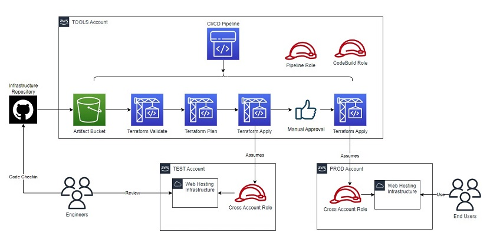

# AWS Continuous Delivery Pipeline (work in progress)
This repository contains terraform configuration files and other supporting files for provisioning a cross-account continuous delivery pipeline where code changes are built, tested, and pushed to staging with manual approval to production

## To-Do List:
- clean up sample static site files so that anyone can demo the pipeline (remove dns resources)

## Pre reqs
- a git repo with terraform configuration files
- three aws accounts: tools, test/staging, and prod
- an iam role on all three accounts with admin permissons
  - create a trust realtionship from the staging and prod iam roles back to the tools role
  - give the tools iam role the permissions to sts:AssumeRole on the staging and prod roles
  - recommend updating role permissions to only allow required actions instead of admin rights
- install and configure terraform on local

## Getting Started
Clone this repo to local and perform terraform init/validate/plan/apply from the infra directory

## Pipeline Architecture

